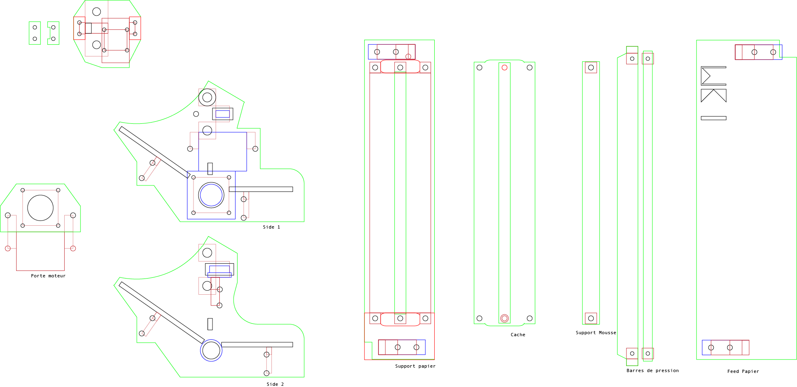
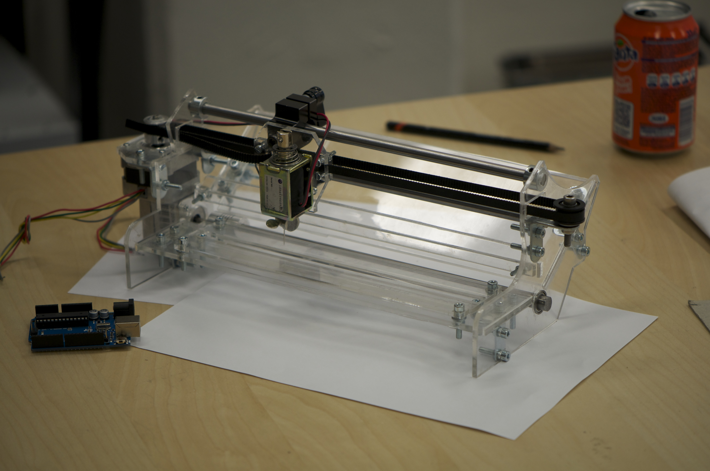

# WKP: a weird kind of printer

This is the project that kickstarted my love for DIY CNC machine!

(click gif for video)

This is an arduino-powered printer that use a solenoid with a needle as a head. The result? Some sort of perforated/embossed image. I personally used it as a quick replacement for silk-screens.

The whole printer can be easily reproduced. See [here]( Hardware/BOM_parts.ods) for the BOM and [here](Hardware/Plan2D.ai) for the laser cutter parts.

Basically to make this printer you need to:

* Purchase the BOM
* Laser cut the parts
* Use an arduino with a [TIP120](http://bildr.org/2011/03/high-power-control-with-arduino-and-tip120/) for solenoid control. I used adafruit motor shield for the stepper control, but you can also use any other shield or even directly some DRV8833.
* Upload the arduino program (match the pin to your layout)
* Use the processing program to send the datas! 

You will have to fill-in some blanks, but I assure you this is loads of fun! 

Here for the finished result! 

